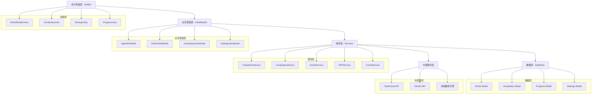
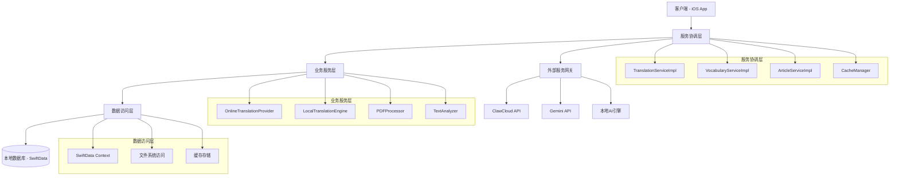
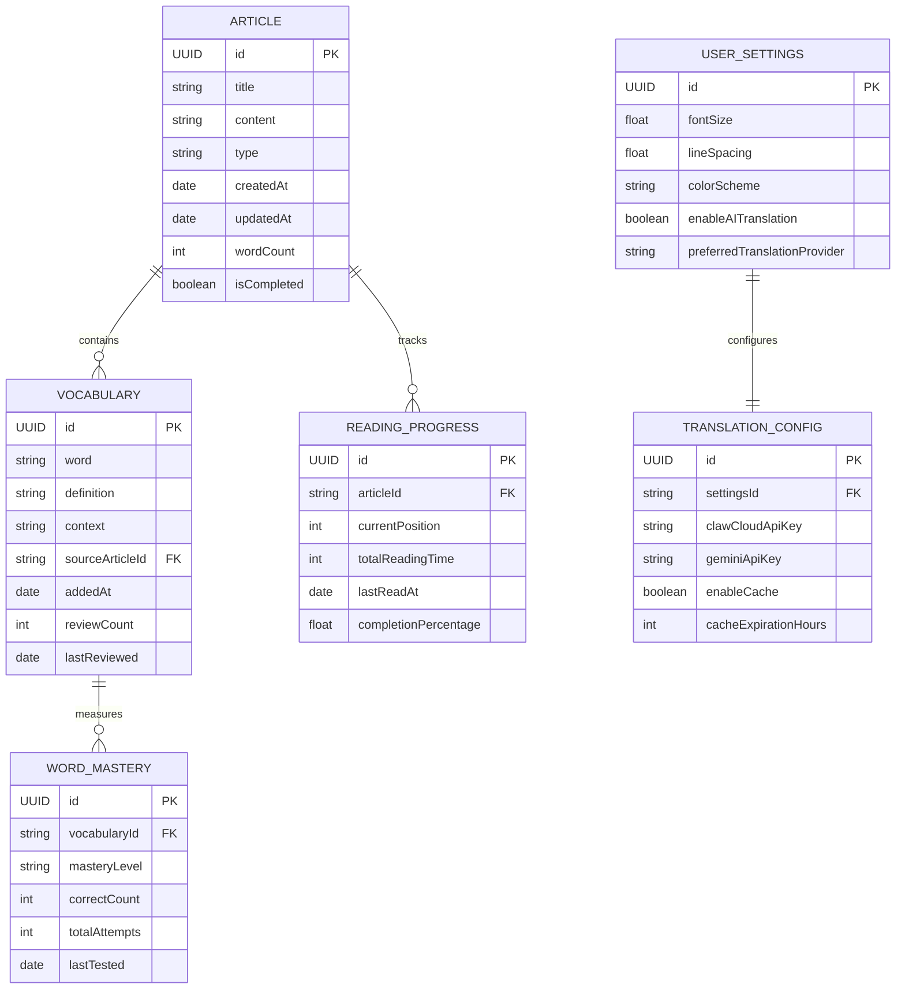

# CruEnglish 技术架构文档

## 1. 架构设计



## 2. 技术描述

### 核心技术栈
- **前端**: SwiftUI (iOS 17.0+) + Combine
- **数据持久化**: SwiftData
- **PDF处理**: PDFKit
- **异步处理**: Swift Concurrency (async/await)
- **依赖注入**: Environment Objects
- **缓存**: 自定义缓存系统
- **AI翻译**: ClawCloud + Gemini API
- **本地翻译**: Core ML + NaturalLanguage

### 架构模式
- **MVVM**: Model-View-ViewModel 架构模式
- **依赖注入**: 使用 Environment 进行全局状态管理
- **协调器模式**: WordInteractionCoordinator 统一管理取词交互
- **服务层模式**: 业务逻辑与视图分离
- **观察者模式**: 使用 @Published 和 Combine 进行状态管理

## 3. 路由定义

| 路由 | 目的 | 实现方式 |
|------|------|----------|
| / | 主页面，显示文章列表和导航 | ContentView |
| /article/:id | 文章阅读页面，支持多种阅读模式 | ArticleReaderView |
| /vocabulary | 词汇管理页面，个人词典和学习进度 | VocabularyView |
| /settings | 设置页面，个性化配置和AI翻译设置 | SettingsView |
| /progress | 学习进度页面，统计和分析 | ProgressView |
| /import | 文章导入页面，支持PDF和文本导入 | ImportView |

## 4. API定义

### 4.1 核心服务API

#### 翻译服务 (TranslationService)

**单词翻译**
```swift
func translateWord(
    _ word: String,
    context: String,
    provider: TranslationProvider
) async throws -> Translation
```

参数:
| 参数名 | 参数类型 | 是否必需 | 描述 |
|--------|----------|----------|------|
| word | String | true | 要翻译的单词 |
| context | String | true | 上下文信息 |
| provider | TranslationProvider | true | 翻译服务提供商 |

返回值:
| 参数名 | 参数类型 | 描述 |
|--------|----------|------|
| translation | Translation | 翻译结果对象 |

**句子翻译**
```swift
func translateSentence(
    _ sentence: String,
    context: String,
    provider: TranslationProvider
) async throws -> Translation
```

#### 词汇服务 (VocabularyService)

**添加生词**
```swift
func addWord(
    _ word: String,
    definition: String,
    context: String
) async throws -> Bool
```

**获取词汇掌握度**
```swift
func getWordMastery(_ word: String) -> WordMasteryLevel
```

#### 文章服务 (ArticleService)

**导入文章**
```swift
func importArticle(
    title: String,
    content: String,
    type: ArticleType
) async throws -> Article
```

**获取文章列表**
```swift
func getArticles() async throws -> [Article]
```

### 4.2 外部API集成

#### ClawCloud API

**连通性检查**
```
GET https://xxobadygvwbx.ap-southeast-1.clawcloudrun.com/v1/models
Authorization: Bearer tankoni
Content-Type: application/json
```

**翻译请求**
```
POST https://xxobadygvwbx.ap-southeast-1.clawcloudrun.com/v1/chat/completions
Authorization: Bearer tankoni
Content-Type: application/json
```

请求体:
```json
{
  "model": "gpt-4o-mini",
  "messages": [
    {
      "role": "user",
      "content": "翻译提示词"
    }
  ],
  "max_tokens": 1000,
  "temperature": 0.3
}
```

#### Gemini Direct API

**翻译请求**
```
POST https://generativelanguage.googleapis.com/v1beta/models/gemini-1.5-flash:generateContent
Content-Type: application/json
x-goog-api-key: {API_KEY}
```

## 5. 服务器架构图



## 6. 数据模型

### 6.1 数据模型定义



### 6.2 数据定义语言 (DDL)

#### Article 表
```swift
@Model
class Article {
    @Attribute(.unique) var id: UUID = UUID()
    var title: String = ""
    var content: String = ""
    var type: ArticleType = .text
    var createdAt: Date = Date()
    var updatedAt: Date = Date()
    var wordCount: Int = 0
    var isCompleted: Bool = false
    var readingProgress: ReadingProgress?
    
    // 关联的词汇
    @Relationship(deleteRule: .cascade)
    var vocabularies: [Vocabulary] = []
    
    init(title: String, content: String, type: ArticleType = .text) {
        self.title = title
        self.content = content
        self.type = type
        self.wordCount = content.split(separator: " ").count
    }
}
```

#### Vocabulary 表
```swift
@Model
class Vocabulary {
    @Attribute(.unique) var id: UUID = UUID()
    var word: String = ""
    var definition: String = ""
    var context: String = ""
    var addedAt: Date = Date()
    var reviewCount: Int = 0
    var lastReviewed: Date?
    var masteryLevel: WordMasteryLevel = .unfamiliar
    
    // 关联的文章
    var sourceArticle: Article?
    
    init(word: String, definition: String, context: String = "") {
        self.word = word.lowercased()
        self.definition = definition
        self.context = context
    }
}
```

#### ReadingProgress 表
```swift
@Model
class ReadingProgress {
    @Attribute(.unique) var id: UUID = UUID()
    var currentPosition: Int = 0
    var totalReadingTime: TimeInterval = 0
    var lastReadAt: Date = Date()
    var completionPercentage: Float = 0.0
    
    // 关联的文章
    var article: Article?
    
    init(article: Article) {
        self.article = article
    }
}
```

#### Settings 表
```swift
@Model
class Settings {
    @Attribute(.unique) var id: UUID = UUID()
    
    // 阅读设置
    var fontSize: Float = 16.0
    var lineSpacing: Float = 1.2
    var colorScheme: String = "system"
    
    // AI翻译设置
    var enableAITranslation: Bool = true
    var preferredTranslationProvider: String = "clawcloud"
    var clawCloudApiKey: String = "tankoni"
    var geminiApiKey: String = ""
    
    // 缓存设置
    var enableTranslationCache: Bool = true
    var cacheExpirationHours: Int = 24
    
    // 学习设置
    var dailyGoalMinutes: Int = 30
    var enableSmartReview: Bool = true
    var autoSaveWords: Bool = true
    
    init() {}
}
```

### 6.3 索引和性能优化

```swift
// 为频繁查询的字段创建索引
// SwiftData 会自动为 @Attribute(.unique) 创建索引

// 词汇表按单词查询优化
extension Vocabulary {
    static func findByWord(_ word: String, in context: ModelContext) -> Vocabulary? {
        let descriptor = FetchDescriptor<Vocabulary>(
            predicate: #Predicate { $0.word == word.lowercased() }
        )
        return try? context.fetch(descriptor).first
    }
}

// 文章按类型和完成状态查询优化
extension Article {
    static func fetchByType(_ type: ArticleType, in context: ModelContext) -> [Article] {
        let descriptor = FetchDescriptor<Article>(
            predicate: #Predicate { $0.type == type },
            sortBy: [SortDescriptor(\.updatedAt, order: .reverse)]
        )
        return (try? context.fetch(descriptor)) ?? []
    }
}
```

### 6.4 数据迁移策略

```swift
// 版本化模型配置
static let modelConfiguration = ModelConfiguration(
    schema: Schema([
        Article.self,
        Vocabulary.self,
        ReadingProgress.self,
        Settings.self
    ]),
    isStoredInMemoryOnly: false,
    allowsSave: true
)

// 数据迁移处理
static func performDataMigration() {
    // 检查数据版本
    // 执行必要的数据迁移
    // 更新数据模型版本
}
```

## 7. 并发和性能优化

### 7.1 Swift Concurrency 使用

```swift
// 主线程隔离
@MainActor
class ConstraintConflictResolver: ObservableObject {
    // 所有UI相关操作都在主线程执行
}

@MainActor
class InputFocusManager: ObservableObject {
    // 焦点管理确保在主线程执行
}

// 异步任务处理
func translateText() async {
    Task {
        let result = await performTranslation()
        await MainActor.run {
            updateUI(with: result)
        }
    }
}
```

### 7.2 缓存策略

```swift
// 翻译结果缓存
class TranslationCache {
    private let cache = NSCache<NSString, Translation>()
    private let expirationTime: TimeInterval = 24 * 60 * 60 // 24小时
    
    func store(_ translation: Translation, for key: String) {
        cache.setObject(translation, forKey: key as NSString)
    }
    
    func retrieve(for key: String) -> Translation? {
        return cache.object(forKey: key as NSString)
    }
}
```

### 7.3 性能监控

```swift
// 性能指标收集
class PerformanceMonitor {
    static func measureTranslationTime<T>(
        operation: () async throws -> T
    ) async rethrows -> (result: T, duration: TimeInterval) {
        let startTime = CFAbsoluteTimeGetCurrent()
        let result = try await operation()
        let duration = CFAbsoluteTimeGetCurrent() - startTime
        return (result, duration)
    }
}
```

## 8. 错误处理和日志

### 8.1 统一错误处理

```swift
// 错误类型定义
enum AppError: LocalizedError {
    case networkError(Error)
    case translationFailed(String)
    case dataCorruption
    case serviceUnavailable(String)
    
    var errorDescription: String? {
        switch self {
        case .networkError(let error):
            return "网络错误: \(error.localizedDescription)"
        case .translationFailed(let reason):
            return "翻译失败: \(reason)"
        case .dataCorruption:
            return "数据损坏"
        case .serviceUnavailable(let service):
            return "服务不可用: \(service)"
        }
    }
}
```

### 8.2 日志系统

```swift
import OSLog

// 统一日志记录
struct AppLogger {
    private static let subsystem = "com.en01.crulish"
    
    static let translation = Logger(subsystem: subsystem, category: "Translation")
    static let vocabulary = Logger(subsystem: subsystem, category: "Vocabulary")
    static let article = Logger(subsystem: subsystem, category: "Article")
    static let performance = Logger(subsystem: subsystem, category: "Performance")
}
```

## 9. 安全性和隐私

### 9.1 API密钥管理

```swift
// 安全的API密钥存储
class SecureStorage {
    private let keychain = Keychain(service: "com.en01.crulish")
    
    func storeAPIKey(_ key: String, for service: String) {
        keychain[service] = key
    }
    
    func retrieveAPIKey(for service: String) -> String? {
        return keychain[service]
    }
}
```

### 9.2 数据隐私

- 所有用户数据本地存储，不上传到服务器
- 翻译请求不包含用户个人信息
- API调用使用HTTPS加密传输
- 缓存数据定期清理

## 10. 测试策略

### 10.1 单元测试

```swift
// 翻译服务测试
class TranslationServiceTests: XCTestCase {
    func testWordTranslation() async throws {
        let service = TranslationServiceImpl()
        let result = try await service.translateWord(
            "hello",
            context: "greeting",
            provider: .local
        )
        XCTAssertNotNil(result)
    }
}
```

### 10.2 集成测试

```swift
// AI翻译集成测试
class AITranslationIntegrationTests: XCTestCase {
    func testClawCloudConnectivity() async {
        let provider = OnlineTranslationProvider()
        let isConnected = await provider.checkClawCloudConnectivity()
        XCTAssertTrue(isConnected)
    }
}
```

---

**文档版本**: v1.0  
**最后更新**: 2024年12月19日  
**维护者**: 开发团队