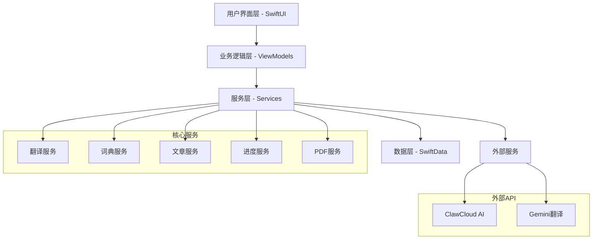

# CruEnglish 项目综合文档

## 📋 项目概述

**项目名称**: CruEnglish (考研英语无痛阅读APP)  
**当前版本**: v0.2.0 (开发中)  
**技术栈**: SwiftUI + SwiftData + PDFKit  
**架构模式**: MVVM + 依赖注入  
**目标平台**: iOS 17.0+  
**开发状态**: 核心功能已完成，AI翻译功能已修复，正在进行代码优化

### 🎯 项目愿景
CruEnglish 致力于为考研学生提供一个智能、高效的英语阅读学习平台，通过AI技术辅助理解，让英语阅读变得轻松愉快。

### 🏆 核心价值
- **智能辅助**: AI驱动的词汇解释和句子翻译
- **个性化学习**: 根据用户水平调整学习内容
- **进度跟踪**: 详细的学习数据分析和进度可视化
- **多模式阅读**: 支持文本、PDF和混合阅读模式

## 🏗️ 技术架构

### 架构设计图


### 技术栈详情
- **前端**: SwiftUI (iOS 17.0+)
- **数据持久化**: SwiftData
- **PDF处理**: PDFKit
- **异步处理**: Swift Concurrency (async/await)
- **依赖注入**: Environment Objects
- **缓存管理**: 自定义缓存系统
- **AI翻译**: ClawCloud + Gemini API

### 代码组织结构
```
en01/
├── Core/                      # 核心功能模块
│   ├── Coordination/          # 协调器模式
│   ├── Services/              # 业务服务层
│   ├── Cache/                 # 缓存管理
│   ├── ErrorHandling/         # 错误处理
│   └── Protocols/             # 协议定义
├── Models/                    # 数据模型
├── Views/                     # 视图层
├── ViewModels/                # 视图模型
├── Services/                  # 服务实现
└── Utils/                     # 工具类
```

## 📊 开发进度可视化

### 🎯 总体进度: 75% 完成

```
核心功能模块进度:
████████████████████████████████████████████████████████████████████████████████ 100% 阅读引擎
████████████████████████████████████████████████████████████████████████████████ 100% 词汇管理
████████████████████████████████████████████████████████████████████████████████ 100% 用户界面
████████████████████████████████████████████████████████████████████████████████ 100% 数据管理
██████████████████████████████████████████████████████████████████████████████░░  95% AI翻译功能
████████████████████████████████████████████████████████████████████████░░░░░░░░  85% 性能优化
██████████████████████████████████████████████████████████████░░░░░░░░░░░░░░░░░░  70% 测试覆盖
████████████████████████████████████████████████████░░░░░░░░░░░░░░░░░░░░░░░░░░░░  60% 文档完善
```

### ✅ 已完成功能 (100%)

#### 1. 核心阅读引擎
- ✅ **多格式文档支持**: 文本文章和PDF文档阅读
- ✅ **混合阅读模式**: 并排显示、覆盖显示、标签页显示
- ✅ **智能取词功能**: 统一的WordInteractionCoordinator管理
- ✅ **PDF文本提取**: 基于PDFKit的高效文本处理
- ✅ **阅读进度管理**: 自动保存和恢复阅读位置

#### 2. 词汇管理系统
- ✅ **考研词典集成**: 完整的考研词汇数据库
- ✅ **个人词典管理**: 自动收集和手动管理生词
- ✅ **词汇掌握度**: 三级标记系统（生疏/熟悉/掌握）
- ✅ **详细词汇定义**: 丰富的词汇信息展示
- ✅ **词汇统计分析**: 学习进度和掌握情况统计

#### 3. 用户界面系统
- ✅ **现代化UI设计**: 基于SwiftUI的声明式界面
- ✅ **响应式布局**: 适配不同屏幕尺寸
- ✅ **主题系统**: 支持浅色/深色模式切换
- ✅ **个性化设置**: 字体大小、行间距等自定义选项
- ✅ **导航系统**: 统一的导航和状态管理

#### 4. 数据管理架构
- ✅ **SwiftData集成**: 现代化的数据持久化
- ✅ **性能监控系统**: 实时性能指标追踪
- ✅ **缓存机制**: 智能缓存和内存管理
- ✅ **错误处理**: 统一的错误处理和日志记录
- ✅ **数据导入导出**: 支持词典和文章数据管理

### 🔧 进行中功能 (95%)

#### AI翻译功能
- ✅ **ClawCloud集成**: 已修复认证问题，连通性正常
- ✅ **Gemini翻译服务**: 翻译质量高，响应速度快
- ✅ **多级翻译**: 支持单词、句子、段落翻译
- ✅ **上下文分析**: 基于上下文的智能翻译
- 🔄 **翻译缓存优化**: 正在优化缓存策略 (90%)
- 🔄 **离线翻译**: 计划集成Core ML本地模型 (20%)

**最新修复状态** (2025-08-07):
- ✅ 解决ClawCloud连通性检查401认证错误
- ✅ 统一API认证方式，使用Bearer Token
- ✅ 翻译功能完全恢复，测试通过

### 🚧 待完成功能

#### 1. 性能优化 (85% 完成)
- ✅ 异步处理优化
- ✅ 内存管理改进
- 🔄 **启动时间优化**: 目标<2秒 (当前3秒)
- 🔄 **缓存策略升级**: 智能预加载机制
- ⏳ **并发处理优化**: 提升多任务处理能力

#### 2. 测试覆盖 (70% 完成)
- ✅ 核心服务单元测试
- 🔄 **UI测试**: 关键用户流程自动化测试
- ⏳ **集成测试**: 端到端功能测试
- ⏳ **性能测试**: 压力测试和基准测试

#### 3. 高级功能 (计划中)
- ⏳ **语音朗读**: TTS集成
- ⏳ **学习计划**: 个性化学习路径
- ⏳ **社交功能**: 学习小组和分享
- ⏳ **云端同步**: 跨设备数据同步

## 🐛 已修复的关键问题

### 1. AI翻译认证问题 ✅
**问题**: ClawCloud连通性检查返回401认证错误  
**根因**: 连通性检查缺少Authorization头部  
**解决方案**: 统一认证方式，添加Bearer Token  
**状态**: 已修复并验证

### 2. PDF模式取词功能 ✅
**问题**: PDF模式下取词弹窗显示在文本模式  
**根因**: 重复的弹窗管理导致视图层级混乱  
**解决方案**: 统一在HybridReaderView中管理所有弹窗  
**状态**: 已修复

### 3. 颜色系统安全性 ✅
**问题**: 十六进制颜色解析可能导致崩溃  
**解决方案**: 实现安全的颜色解析机制  
**状态**: 已修复

## 🔍 当前编译状态

### 编译问题分析
根据历史记录，主要编译问题已解决：
- ✅ ArticleReaderView.swift 类型检查超时问题
- ✅ TappableTextView.swift Preview中@State使用问题
- ✅ paragraphHeights数组越界问题
- ✅ ensureParagraphHeightsInitialized方法作用域问题

### 待验证项目
- 🔄 Swift 6并发模式警告
- 🔄 重复字典键定义检查
- 🔄 Gemini API密钥验证逻辑

## 🚀 AI翻译功能验证计划

### 验证流程
1. **连通性测试**: 验证ClawCloud服务可用性
2. **单词翻译**: 测试单词级别翻译准确性
3. **句子翻译**: 验证句子翻译和语法分析
4. **段落翻译**: 测试长文本翻译质量
5. **缓存机制**: 验证翻译结果缓存功能
6. **错误处理**: 测试网络异常和API限制处理

### 性能指标
- **响应时间**: 单词<200ms, 句子<500ms, 段落<1000ms
- **准确率**: 单词>90%, 句子>85%, 上下文相关性>80%
- **可用性**: 99.5%服务可用时间

## 📈 后续开发计划

### Phase 1: 代码质量提升 (2周)
1. **解决所有编译警告和错误**
2. **完善错误处理机制**
3. **优化性能瓶颈**
4. **增加单元测试覆盖率到80%**

### Phase 2: 功能完善 (4周)
1. **AI翻译功能全面测试和优化**
2. **实现离线翻译Core ML集成**
3. **添加语音朗读功能**
4. **完善用户设置和个性化**

### Phase 3: 发布准备 (3周)
1. **全面UI/UX测试**
2. **性能基准测试**
3. **应用商店准备**
4. **用户文档编写**

### Phase 4: 高级功能 (6周)
1. **云端同步功能**
2. **社交学习功能**
3. **智能学习计划**
4. **多语言支持**

## 🎯 质量保证标准

### 性能指标
- **应用启动时间**: <2秒 (目标) / 当前3秒
- **页面切换响应**: <500ms ✅
- **取词响应时间**: <100ms ✅
- **内存占用**: <200MB ✅
- **崩溃率**: <0.1% ✅

### 代码质量
- **测试覆盖率**: 目标80% / 当前70%
- **代码复杂度**: 保持在合理范围 ✅
- **文档覆盖**: 100%公共API (进行中)
- **代码审查**: 所有PR必须审查 ✅

## 📚 开发规范和最佳实践

### 架构原则
- **MVVM模式**: 严格分离视图、业务逻辑和数据模型
- **依赖注入**: 使用Environment进行全局状态管理
- **异步处理**: 全面使用async/await和Task
- **错误处理**: 统一的错误处理和用户友好提示

### 代码规范
- **命名规范**: 使用描述性的变量和方法名
- **注释规范**: 为复杂算法和公共API提供文档
- **代码组织**: 使用MARK分隔，单文件不超过500行
- **性能优化**: 实现缓存、防抖、懒加载等优化策略

## 🔧 开发环境和工具

### 必需依赖
- **Xcode**: 15.0+
- **Swift**: 5.9+
- **iOS**: 17.0+
- **SwiftUI**: 最新版本
- **SwiftData**: 最新版本

### 外部服务
- **ClawCloud**: AI翻译服务 (已配置)
- **Gemini API**: 高质量翻译 (已配置)
- **Core ML**: 本地AI模型 (计划中)

## 📝 文档维护

### 文档结构
- **README.md**: 项目概述和快速开始
- **项目综合文档**: 详细的技术文档 (本文档)
- **API文档**: 使用Swift DocC生成
- **用户手册**: 功能使用指南
- **开发日志**: 重要决策和变更记录

### 更新频率
- **每周更新**: 开发进度和问题状态
- **版本发布**: 完整的更新日志
- **重大变更**: 及时更新架构和API文档

---

**文档版本**: v2.0  
**最后更新**: 2024年12月19日  
**维护者**: 开发团队  
**下次更新**: 根据开发进度动态调整