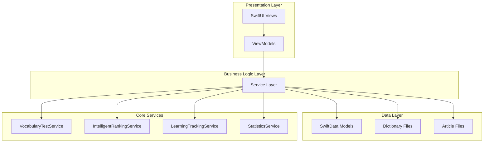
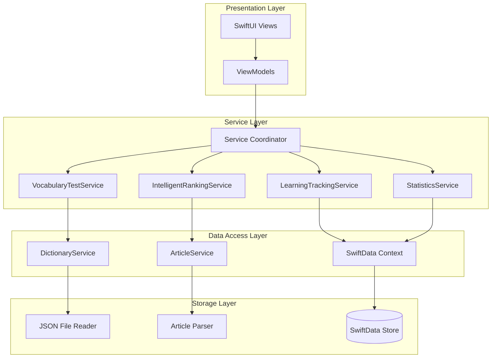
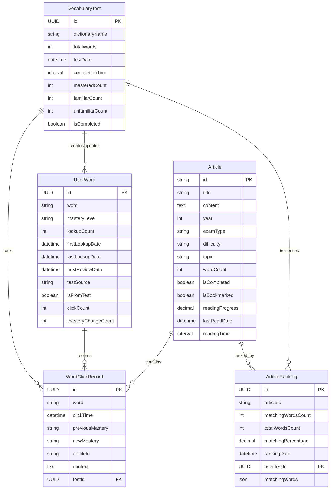

# 词汇管理系统技术架构文档

## 1. 架构设计



## 2. 技术描述

- Frontend: SwiftUI + Combine + Swift Concurrency
- Backend: 无独立后端服务
- Database: SwiftData (基于Core Data)
- File Storage: 本地JSON文件存储
- Architecture: MVVM + Service Layer

## 3. 路由定义

| 路由 | 目的 |
|------|------|
| /vocabulary-test | 词汇量测试页面，支持词典选择和单词分类测试 |
| /intelligent-ranking | 智能排序页面，显示按匹配度排序的文章列表 |
| /learning-tracking | 学习跟踪页面，集成在文章阅读中的单词点击收集 |
| /statistics | 统计分析页面，展示学习数据和趋势图表 |
| /test-history | 测试历史页面，查看历史词汇量测试记录 |
| /word-history | 单词历史页面，查看详细的单词点击记录 |

## 4. API定义

### 4.1 核心数据类型

```swift
// 掌握程度枚举
enum MasteryLevel: String, CaseIterable, Codable {
    case unfamiliar = "unfamiliar"  // 陌生
    case familiar = "familiar"      // 眼熟
    case mastered = "mastered"      // 掌握
}

// 统计周期枚举
enum StatisticsPeriod: String, CaseIterable {
    case daily = "daily"           // 每日
    case threeDays = "threeDays"   // 每三天
    case weekly = "weekly"         // 每周
    case monthly = "monthly"       // 每月
}

// 词典信息
struct DictionaryInfo: Codable, Identifiable {
    let id: UUID
    let name: String              // 词典名称
    let fileName: String          // 文件名
    let totalWords: Int           // 总单词数
    let difficulty: String        // 难度级别
    let description: String       // 描述
}

// 词汇测试结果
struct VocabularyTestResult: Codable {
    let testId: UUID
    let dictionaryName: String
    let totalWords: Int
    let masteredCount: Int
    let familiarCount: Int
    let unfamiliarCount: Int
    let completionTime: TimeInterval
    let masteryPercentage: Double
}

// 文章匹配信息
struct ArticleMatchInfo: Codable, Identifiable {
    let id: String
    let article: Article
    let matchingWordsCount: Int
    let totalWordsCount: Int
    let matchingPercentage: Double
    let matchingWords: [String]
}

// 学习统计数据
struct LearningStatistics: Codable {
    let period: StatisticsPeriod
    let totalClicks: Int
    let uniqueWords: Int
    let masteryChanges: Int
    let learningTime: TimeInterval
    let dailyStats: [DailyLearningStats]
}

// 每日学习统计
struct DailyLearningStats: Codable, Identifiable {
    let id: UUID
    let date: Date
    let clickCount: Int
    let uniqueWordCount: Int
    let masteryUpgrades: Int
    let masteryDowngrades: Int
    let learningTime: TimeInterval
}

// 词汇掌握统计
struct VocabularyMasteryStats: Codable {
    let totalWords: Int
    let masteredCount: Int
    let familiarCount: Int
    let unfamiliarCount: Int
    let masteredPercentage: Double
    let familiarPercentage: Double
    let unfamiliarPercentage: Double
    let lastUpdated: Date
}

// 学习趋势点
struct LearningTrendPoint: Codable, Identifiable {
    let id: UUID
    let date: Date
    let value: Double
    let type: TrendType
}

enum TrendType: String, CaseIterable {
    case clickCount = "clickCount"
    case masteryRate = "masteryRate"
    case learningTime = "learningTime"
}
```

### 4.2 Service接口定义

#### VocabularyTestService

```swift
protocol VocabularyTestServiceProtocol {
    // 获取可用词典列表
    func getAvailableDictionaries() async -> [DictionaryInfo]
    
    // 加载词典单词
    func loadDictionaryWords(fileName: String) async throws -> [String]
    
    // 开始词汇量测试
    func startVocabularyTest(dictionaryName: String) async throws -> VocabularyTest
    
    // 提交单词掌握程度
    func submitWordMastery(testId: UUID, word: String, mastery: MasteryLevel) async throws
    
    // 完成测试
    func completeTest(testId: UUID) async throws -> VocabularyTestResult
    
    // 获取测试历史
    func getTestHistory() async -> [VocabularyTest]
    
    // 获取测试进度
    func getTestProgress(testId: UUID) async -> TestProgress
}

struct TestProgress {
    let currentIndex: Int
    let totalWords: Int
    let completedWords: Int
    let remainingWords: Int
    let progressPercentage: Double
}
```

#### IntelligentRankingService

```swift
protocol IntelligentRankingServiceProtocol {
    // 计算文章智能排序
    func calculateArticleRanking() async throws -> [ArticleMatchInfo]
    
    // 获取待学习词汇集合
    func getLearningWordSet() async -> Set<String>
    
    // 计算单篇文章匹配度
    func calculateArticleMatch(article: Article, learningWords: Set<String>) async -> ArticleMatchInfo
    
    // 获取排序后的文章列表
    func getRankedArticles() async -> [ArticleMatchInfo]
    
    // 刷新排序（重新计算）
    func refreshRanking() async throws -> [ArticleMatchInfo]
    
    // 获取排序缓存状态
    func getRankingCacheStatus() -> RankingCacheStatus
}

struct RankingCacheStatus {
    let isValid: Bool
    let lastUpdated: Date?
    let cacheSize: Int
}
```

#### LearningTrackingService

```swift
protocol LearningTrackingServiceProtocol {
    // 记录单词点击
    func recordWordClick(word: String, context: String, articleId: String?) async throws
    
    // 更新单词掌握程度
    func updateWordMastery(word: String, newMastery: MasteryLevel, previousMastery: MasteryLevel?) async throws
    
    // 获取单词当前掌握程度
    func getWordMastery(word: String) async -> MasteryLevel?
    
    // 批量更新单词掌握程度
    func batchUpdateWordMastery(updates: [WordMasteryUpdate]) async throws
    
    // 获取单词点击历史
    func getWordClickHistory(timeRange: DateRange) async -> [WordClickRecord]
    
    // 获取单词详细信息
    func getWordDetails(word: String) async -> WordDetails?
}

struct WordMasteryUpdate {
    let word: String
    let newMastery: MasteryLevel
    let context: String?
}

struct WordDetails {
    let word: String
    let currentMastery: MasteryLevel
    let totalClicks: Int
    let firstSeen: Date?
    let lastClicked: Date?
    let masteryHistory: [MasteryChange]
}

struct MasteryChange {
    let date: Date
    let fromMastery: MasteryLevel?
    let toMastery: MasteryLevel
    let context: String?
}
```

#### StatisticsService

```swift
protocol StatisticsServiceProtocol {
    // 获取词汇掌握统计
    func getVocabularyMasteryStats() async -> VocabularyMasteryStats
    
    // 获取学习趋势数据
    func getLearningTrendData(period: StatisticsPeriod, startDate: Date, endDate: Date) async -> [LearningTrendPoint]
    
    // 获取每日学习统计
    func getDailyLearningStats(date: Date) async -> DailyLearningStats?
    
    // 获取周期性学习统计
    func getPeriodicLearningStats(period: StatisticsPeriod, date: Date) async -> LearningStatistics
    
    // 获取学习报告
    func generateLearningReport(period: StatisticsPeriod, startDate: Date, endDate: Date) async -> LearningReport
    
    // 导出统计数据
    func exportStatisticsData(format: ExportFormat) async throws -> Data
}

struct LearningReport {
    let period: StatisticsPeriod
    let startDate: Date
    let endDate: Date
    let totalStats: LearningStatistics
    let highlights: [ReportHighlight]
    let recommendations: [String]
}

struct ReportHighlight {
    let type: HighlightType
    let title: String
    let description: String
    let value: String
}

enum HighlightType {
    case achievement
    case improvement
    case milestone
    case recommendation
}

enum ExportFormat {
    case json
    case csv
    case pdf
}
```

## 5. 服务器架构图

由于本系统采用纯客户端架构，无独立服务器，以下为客户端内部服务层架构：



## 6. 数据模型

### 6.1 数据模型定义



### 6.2 数据定义语言

#### VocabularyTest表
```swift
@Model
class VocabularyTest {
    @Attribute(.unique) var id: UUID
    var dictionaryName: String
    var totalWords: Int
    var testDate: Date
    var completionTime: TimeInterval?
    var masteredCount: Int
    var familiarCount: Int
    var unfamiliarCount: Int
    var isCompleted: Bool
    
    init(dictionaryName: String, totalWords: Int) {
        self.id = UUID()
        self.dictionaryName = dictionaryName
        self.totalWords = totalWords
        self.testDate = Date()
        self.masteredCount = 0
        self.familiarCount = 0
        self.unfamiliarCount = 0
        self.isCompleted = false
    }
}
```

#### WordClickRecord表
```swift
@Model
class WordClickRecord {
    @Attribute(.unique) var id: UUID
    var word: String
    var clickTime: Date
    var previousMastery: String?
    var newMastery: String
    var articleId: String?
    var context: String
    var testId: UUID?
    
    init(word: String, newMastery: MasteryLevel, context: String = "") {
        self.id = UUID()
        self.word = word
        self.clickTime = Date()
        self.newMastery = newMastery.rawValue
        self.context = context
    }
}
```

#### ArticleRanking表
```swift
@Model
class ArticleRanking {
    @Attribute(.unique) var id: UUID
    var articleId: String
    var matchingWordsCount: Int
    var totalWordsCount: Int
    var matchingPercentage: Double
    var rankingDate: Date
    var userTestId: UUID
    var matchingWordsData: Data? // JSON encoded [String]
    
    var matchingWords: [String] {
        get {
            guard let data = matchingWordsData else { return [] }
            return (try? JSONDecoder().decode([String].self, from: data)) ?? []
        }
        set {
            matchingWordsData = try? JSONEncoder().encode(newValue)
        }
    }
    
    init(articleId: String, matchingWordsCount: Int, totalWordsCount: Int, userTestId: UUID) {
        self.id = UUID()
        self.articleId = articleId
        self.matchingWordsCount = matchingWordsCount
        self.totalWordsCount = totalWordsCount
        self.matchingPercentage = Double(matchingWordsCount) / Double(totalWordsCount) * 100
        self.rankingDate = Date()
        self.userTestId = userTestId
    }
}
```

#### UserWord扩展
```swift
extension UserWord {
    // 添加测试相关属性
    var testSource: String? // 来源测试的词典名称
    var isFromTest: Bool = false // 是否来自词汇量测试
    var clickCount: Int = 0 // 总点击次数
    var masteryChangeCount: Int = 0 // 掌握程度变更次数
    
    // 更新掌握程度的方法
    func updateMasteryLevel(_ newLevel: MasteryLevel, context: String = "") {
        let previousLevel = self.masteryLevel
        self.masteryLevel = newLevel
        self.lastLookupDate = Date()
        
        if previousLevel != newLevel {
            self.masteryChangeCount += 1
        }
        
        // 更新下次复习时间
        self.nextReviewDate = calculateNextReviewDate(for: newLevel)
    }
    
    // 增加点击次数
    func incrementClickCount() {
        self.clickCount += 1
        self.lookupCount += 1
        self.lastLookupDate = Date()
    }
    
    // 计算下次复习时间
    private func calculateNextReviewDate(for level: MasteryLevel) -> Date {
        let interval = level.nextReviewInterval
        return Date().addingTimeInterval(interval)
    }
}
```

#### 索引创建
```swift
// SwiftData中通过@Attribute设置索引
@Model
class WordClickRecord {
    @Attribute(.unique) var id: UUID
    @Attribute var word: String // 自动创建索引
    @Attribute var clickTime: Date // 自动创建索引
    // ... 其他属性
}

@Model
class ArticleRanking {
    @Attribute(.unique) var id: UUID
    @Attribute var articleId: String
    @Attribute var matchingPercentage: Double // 用于排序的索引
    @Attribute var rankingDate: Date
    // ... 其他属性
}
```

#### 初始数据和迁移
```swift
// 数据迁移服务
class DataMigrationService {
    static func migrateToNewVocabularySystem() async {
        // 1. 检查是否需要迁移
        guard needsMigration() else { return }
        
        // 2. 为现有UserWord添加新字段默认值
        await updateExistingUserWords()
        
        // 3. 创建默认词典信息
        await createDefaultDictionaries()
        
        // 4. 标记迁移完成
        markMigrationComplete()
    }
    
    private static func updateExistingUserWords() async {
        // 更新现有UserWord记录，添加新字段的默认值
    }
    
    private static func createDefaultDictionaries() async {
        // 创建默认的词典信息记录
    }
}

// 示例初始数据
let defaultDictionaries = [
    DictionaryInfo(
        id: UUID(),
        name: "考研核心词汇1",
        fileName: "KaoYan_1.json",
        totalWords: 2000,
        difficulty: "基础",
        description: "考研英语核心词汇第一册，适合基础阶段学习"
    ),
    DictionaryInfo(
        id: UUID(),
        name: "考研核心词汇2",
        fileName: "KaoYan_2.json",
        totalWords: 2500,
        difficulty: "进阶",
        description: "考研英语核心词汇第二册，适合进阶阶段学习"
    )
]
```

## 7. 性能优化策略

### 7.1 数据加载优化

```swift
// 分页加载大词典
class PaginatedDictionaryLoader {
    private let pageSize = 100
    
    func loadWordsPage(fileName: String, page: Int) async throws -> [String] {
        // 实现分页加载逻辑
    }
}

// 缓存机制
class CacheManager {
    private var rankingCache: [String: [ArticleMatchInfo]] = [:]
    private let cacheExpiry: TimeInterval = 300 // 5分钟
    
    func getCachedRanking(key: String) -> [ArticleMatchInfo]? {
        // 实现缓存获取逻辑
    }
    
    func setCachedRanking(key: String, value: [ArticleMatchInfo]) {
        // 实现缓存设置逻辑
    }
}
```

### 7.2 并发处理

```swift
// 并行计算文章匹配度
func calculateAllArticleMatches(articles: [Article], learningWords: Set<String>) async -> [ArticleMatchInfo] {
    return await withTaskGroup(of: ArticleMatchInfo.self) { group in
        var results: [ArticleMatchInfo] = []
        
        for article in articles {
            group.addTask {
                return await self.calculateArticleMatch(article: article, learningWords: learningWords)
            }
        }
        
        for await result in group {
            results.append(result)
        }
        
        return results.sorted { $0.matchingPercentage > $1.matchingPercentage }
    }
}
```

### 7.3 内存管理

```swift
// 使用弱引用避免循环引用
class VocabularyTestViewModel: ObservableObject {
    weak var coordinator: AppCoordinator?
    private let testService: VocabularyTestService
    
    // 及时释放大对象
    deinit {
        clearCache()
    }
}
```